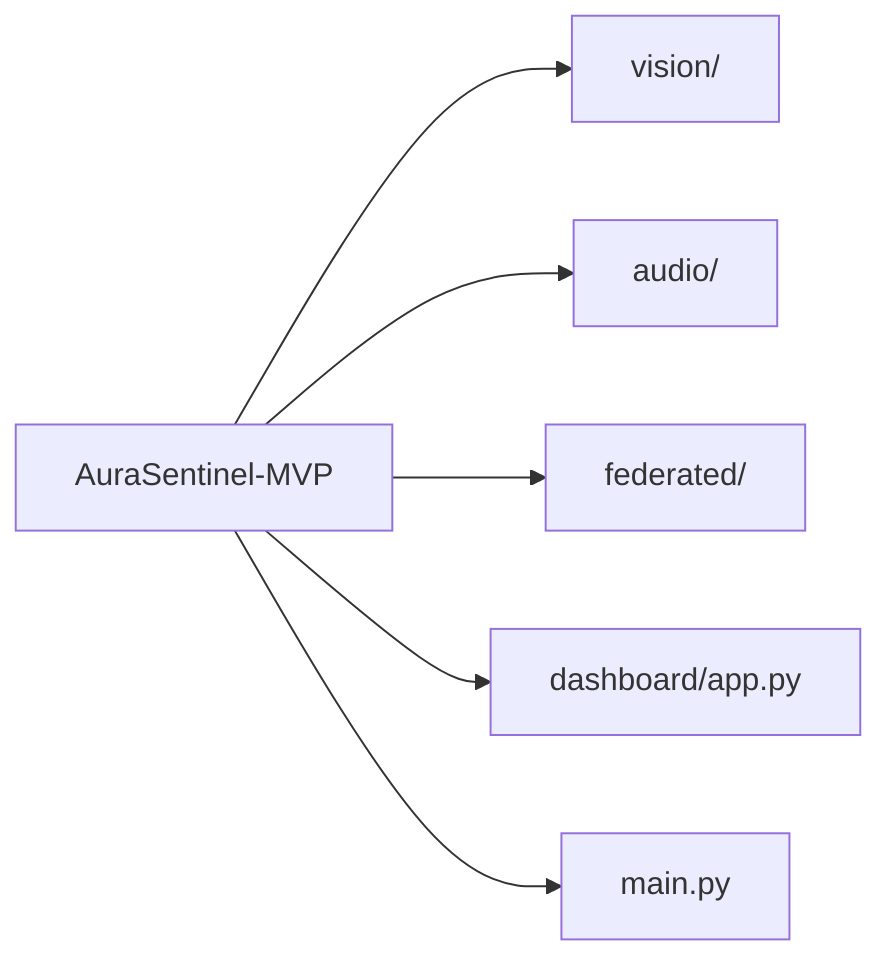

# AuraSentinel MVP

> AI-powered real-time tension detection for retail environments — privacy-first, edge-processed, continuously improving.

AuraSentinel detects early signs of aggression, medical distress, and suspicious behaviour in stores by combining body movement analysis and audio cues. Staff receive discreet alerts on a mobile app and provide feedback that improves the system via federated learning — without any raw data ever leaving the store.

---

## Architecture



---

## Modules

| Module | Description |
|--------|-------------|
| [vision/tracker.py](vision/tracker.py) | YOLOv8 person tracking across video frames |
| [vision/pose_estimator.py](vision/pose_estimator.py) | MediaPipe Pose — 33-keypoint skeleton extraction |
| [vision/tension_scorer.py](vision/tension_scorer.py) | Visual tension from arm raise, movement speed, torso lean |
| [audio/anonymizer.py](audio/anonymizer.py) | Non-reversible voice anonymization (pitch + formant shift) |
| [audio/analyzer.py](audio/analyzer.py) | Audio tension from energy, pitch variance, spectral flux |
| [federated/model.py](federated/model.py) | Logistic regression tension classifier |
| [federated/client.py](federated/client.py) | Flower FL client — local training per store |
| [federated/server.py](federated/server.py) | FedAvg aggregation server |
| [federated/simulate.py](federated/simulate.py) | Run a multi-store FL simulation locally |
| [dashboard/app.py](dashboard/app.py) | Pygame PDA simulator — staff alert interface |

---

## Privacy by Design

- **No facial recognition** — only skeletal pose data (33 joint coordinates)
- **Voice anonymization at the edge** — pitch + formant shift before any inference; raw audio never retained
- **Federated learning** — only model weight updates leave the edge device, never raw sensor data
- **No cloud storage of raw data** — all anonymization happens locally on the Jetson Nano
- GDPR compliant (Article 6(1)(f) — legitimate interest)

---

## Quick Start

```bash
# Install dependencies
pip install -r requirements.txt

# Run video analysis pipeline
python main.py

# Run federated learning simulation (3 stores, 5 rounds)
python federated/simulate.py

# Launch staff alert dashboard
python dashboard/app.py
```

---

## Federated Learning Simulation

The FL simulation demonstrates the privacy-preserving feedback loop:

1. **3 store clients** each hold local feedback data (staff confirmed/rejected alerts)
2. Each client trains the tension classifier locally — **no raw data leaves the node**
3. The server aggregates weight updates using **FedAvg** into a global model
4. The global model improves across rounds and benefits all stores

```
Round 1: accuracy ~60%
Round 2: accuracy ~68%
...
Round 5: accuracy ~78%
```

Run it:
```bash
python federated/simulate.py
```

---

## Tech Stack

| Layer | Technology |
|-------|-----------|
| Object tracking | YOLOv8 nano (ultralytics) |
| Pose estimation | MediaPipe Pose |
| Audio processing | Librosa, PyDub, PyAudio |
| Federated learning | Flower (flwr) |
| Staff dashboard | Pygame |
| Edge hardware | NVIDIA Jetson Nano |
